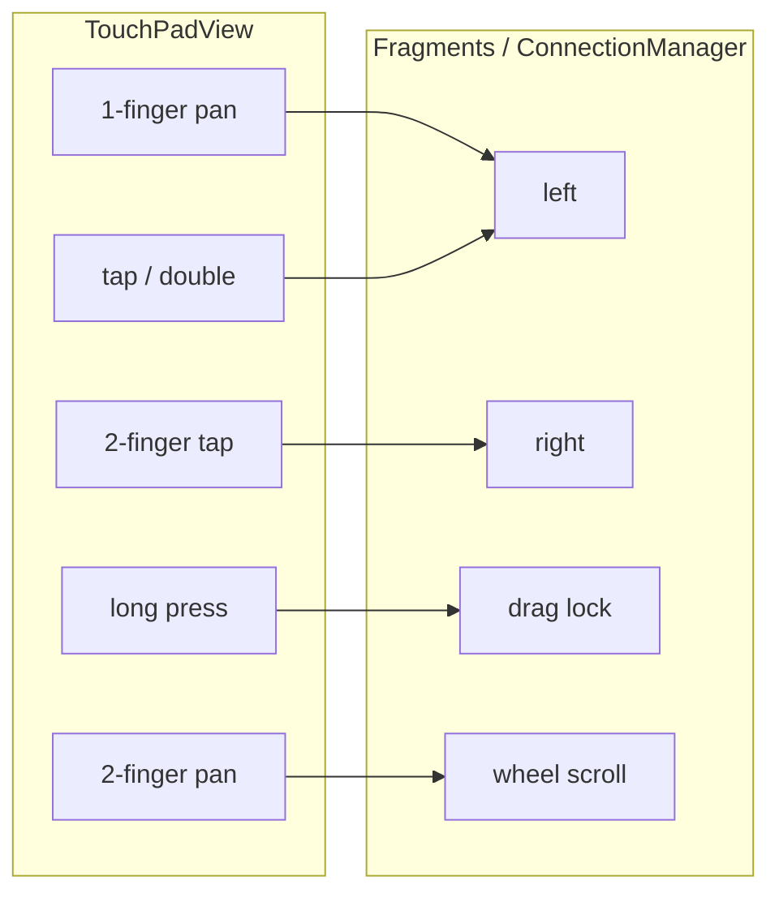

# Touchpad control: design analysis and improvement directions

## Current architecture (what exists)

| Layer | Role |
|--------|------|
| [`TouchPadView.java`](app/src/main/java/com/openterface/keymod/TouchPadView.java) | 1-finger move / tap / double-tap / long-press; 2-finger tap (right) + 2-finger pan (scroll). Scroll sensitivity from prefs. |
| [`CompositeFragment.java`](app/src/main/java/com/openterface/fragment/CompositeFragment.java) / [`MouseFragment.java`](app/src/main/java/com/openterface/fragment/MouseFragment.java) | Map gestures to CH9329 relative mouse packets; drag lock via `setDragMode` + `sendMouseButtonState`; tap/double-tap exit drag only. |
| [`PresentationFragment.java`](app/src/main/java/com/openterface/fragment/PresentationFragment.java) | Separate dialog touchpad using [`ConnectionManager.sendMouseMovement`](app/src/main/java/com/openterface/keymod/ConnectionManager.java) for clicks (bitmask 1=left, 2=right). No drag model, no `onTouchLongPress` / `onTouchRelease` wiring. |
| HID | [`HIDSender`](app/src/main/java/com/openterface/keymod/HIDSender.java) documents button mask **bit0=left, bit1=right, bit2=middle** (value **4**). [`CH9329MSKBMap`](app/src/main/java/com/openterface/target/CH9329MSKBMap.java) includes `SecMiddleData` / `"04"` for middle in the same family as left/right. |

Help copy lives in [`values/strings.xml`](app/src/main/res/values/strings.xml) (`touch_pad_help_overlay_*`). Settings: only [**scroll sensitivity**](app/src/main/java/com/openterface/keymod/fragments/GeneralSettingsFragment.java) (`touchpad_scroll_sensitivity`), no gesture or button remapping.

---

## Middle mouse button (your example)

**Finding:** Middle click is **not exposed on the touchpad**. The transport layer already supports it (`ConnectionManager.sendMouseClick(..., 4, ...)` per Javadoc; CH9329 map has middle `04`), but:

- Main mouse mode builds **left** (`01`) and **right** (`02`) click packets explicitly in fragments; there is **no** `onTouchMiddleClick` or equivalent in [`TouchPadView.OnTouchPadListener`](app/src/main/java/com/openterface/keymod/TouchPadView.java).
- Users who need middle-click (e.g. **browser tab close**, **3D orbit/CAD**, **paste on X11**, **scroll-wheel click**) have **no in-app path** from the touchpad today unless they use another input path (keyboard macro, host software remap).

**Product decision (iterating the plan):**

- **Use three-finger tap for middle click** — acceptable and aligned with some desktop trackpads.
- **Do not use three-finger motion** (pan, scroll, or drag on three fingers) for any touchpad feature. On many Android devices the OS or OEM assigns **three-finger swipe** to **screenshot**, **partial screenshot**, **switch app**, or other system actions; those gestures often **win over the app** or make behavior unreliable. Implementation should only detect a **brief three-finger touch-down and lift with minimal movement** (tap), mirroring how two-finger tap is distinguished from two-finger scroll via movement thresholds.

**Residual risks for 3-finger tap (still validate on hardware):**

- Some devices may still intercept **any** three-finger contact; QA on common OEMs (Pixel, Samsung, Xiaomi, etc.) is advised.
- Optional **settings toggle** (“3-finger tap → middle click” on/off, default on) remains useful for users who trigger screenshots instead of middle click.

**Fallback if tap is flaky on a device:** keep in backlog **two-finger long-press**, **toolbar M button**, or **corner zone** — not the default path per current direction.

**Firmware note:** Before adding **button 4/5** (browser back/forward), confirm CH9329/firmware accepts extended button bits beyond middle; comments in code only mention three buttons.

---

## Other meaningful gaps

1. **Presentation dialog touchpad vs main**  
   - No drag lock, no release semantics aligned with keyboard+mouse mode.  
   - Double-click is implemented as **two delayed singles** via `sendMouseClick(1)` twice, not the same double-click packet path as [`CompositeFragment`](app/src/main/java/com/openterface/fragment/CompositeFragment.java)—possible subtle host differences.  
   - No gesture help overlay in the dialog.

2. **Interaction while drag is on**  
   - Right-click and two-finger scroll still fire from `TouchPadView` without fragment guards. That can be **useful** (scroll while “holding” drag) or **surprising** (right-click during drag). Worth an explicit product decision and optional status/help line.

3. **Tap latency**  
   - Single tap (including **tap to release drag**) is still gated by **`TAP_DELAY_MS` (150 ms)** in `TouchPadView` to disambiguate double-tap. Optional improvement: when host reports drag-on (or view flag), shorten or skip delay for release-only path.

4. **Discoverability**  
   - Strong: info overlay + compact status strip.  
   - Weak: **no** mention of absent features (middle, back/forward), so power users may assume iOS/macOS parity.

5. **Accessibility**  
   - Touch surface may lack rich **contentDescription** / TalkBack hints for gesture summary (verify layouts [`fragment_composite.xml`](app/src/main/res/layout/fragment_composite.xml), [`fragment_mouse.xml`](app/src/main/res/layout/fragment_mouse.xml)).

6. **Configuration surface**  
   - Beyond scroll speed, there is no **remapping** (e.g. swap 2-finger tap to middle for left-handed workflows).

---

## Suggested prioritization (when you move from analysis to backlog)

| Priority | Item | Rationale |
|----------|------|-----------|
| P1 | **Middle click** via **3-finger tap only** (+ help + haptic + optional disable setting; **no** 3-finger motion) | HID capable; avoids fighting Android 3-finger **swipe** shortcuts (e.g. screenshot). |
| P2 | **Align presentation touchpad** with main behavior where intentional (double-click path, optional drag, dismiss/help) | Reduces “two apps” confusion. |
| P3 | **Drag + multi-touch policy** | Document or constrain right/scroll during drag for predictable UX. |
| P4 | **Tap delay polish** when drag active | Small feel win for “drop”. |
| P5 | **Accessibility pass** on touchpad + help | Inclusion and store policy. |

---

## Conclusion

The current design is **coherent for core laptop trackpad tasks** (move, left, double, right, scroll, drag lock with tap-to-release). The largest **functional** hole relative to a full **three-button** mouse is **middle click**—supported below the UI but **never wired**. Plan is to wire **three-finger tap** only (not three-finger motion), document OEM conflict risk, and add an optional setting plus device QA. Also tighten **presentation parity** and **edge-case policy** during drag as backlog items.
